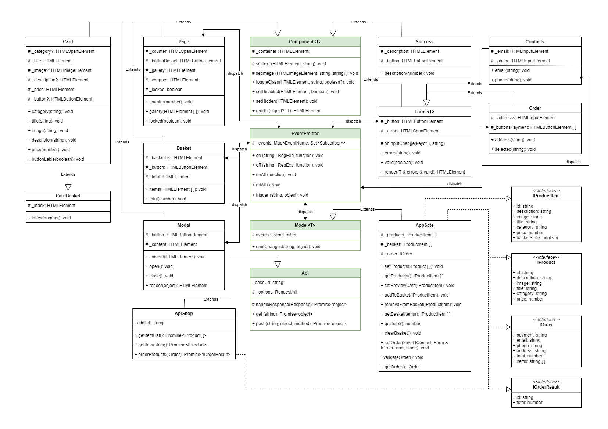

# Проектная работа "Веб-ларек"

Стек: HTML, SCSS, TS, Webpack

Структура проекта:
- src/ — исходные файлы проекта
- src/components/ — папка с JS компонентами
- src/components/base/ — папка с базовым кодом

Важные файлы:
- src/pages/index.html — HTML-файл главной страницы
- src/types/index.ts — файл с типами
- src/index.ts — точка входа приложения
- src/styles/styles.scss — корневой файл стилей
- src/utils/constants.ts — файл с константами
- src/utils/utils.ts — файл с утилитами

## Установка и запуск
Для установки и запуска проекта необходимо выполнить команды

```
npm install
npm run start
```

или

```
yarn
yarn start
```
## Сборка

```
npm run build
```

или

```
yarn build
```


## **Архитектура**

В проекте использован шаблон проектирования MVP (Model-View-Presenter). Коммуникация между классами происходит через события.




### Базовый код

- **Класс `EventEmitter`**
    
    В проекте представляет собой тип Presenter. Это брокер событий. Его функции: возможность установить и снять слушателей событий, вызвать слушателей при возникновении события.
    
    Методы:
    
    `on` — для подписки на событие;
    
    `off` — для подписки на событие;
    
    `emit` — для уведомления подписчиков о наступлении события соответственно;
    
    `onAll` — для сброса всех подписчиков;
    
    `trigger` — генерирующий заданное событие с заданными аргументами. Это позволяет передавать его в качестве обработчика события в другие классы. Эти классы будут генерировать события, не будучи при этом напрямую зависимыми от класса EventEmitter.
    
- **Класс `Api`**
    
    Класс отправляет запросы на сервер. Имеет возможность сделать GET и POST - запросы, а также имеет метод для обработки данных в формат json в ответе от сервера или вывода ошибки при неудачном запросе
    
    Методы:
    
    `handleResponse` — для обработки ответа от сервера: либо преобразует его в формат json, либо формирует ошибку;
    
    `get` — отправляет GET - запрос;
    
    `post` — отправляет POST - запрос.
    
- **Класс `Model<T>`**
    
    Абстрактный класс служит средством для хранения данных поступающих с сервера. В проекте представляет собой тип Model. Принимает в конструктор экземпляр класса `EventEmitter`, благодаря чему реализует метод для уведомления изменения модели и передачи подписчикам измененных данных. Класс является дженериком и принимает в переменной `T` тип и состав данных, которые необходимо сохранить в модели. 
    
    Методы:
    
    `emitChanges` — сообщить об изменении данных в модели.
    
- **Класс `Component<T>`**
    
    В проекте представляет собой тип View. Абстрактный класс базового компонента представляет собой инструментарий для работы с DOM-элементом. Наследуется всеми классами представления. Класс является дженериком и принимает в переменной `T` тип и состав данных, которые необходимы для метода `render`. 
    
    Методы:
    
    `setText` — установить текстовое содержимое;
    
    `setImage` — установить изображение;
    
    `toggleClass` — переключает класс;
    
    `setDisabled` — переключить статус блокировки элемента;

    `setHidden` — скрыть элемент;
    
    `render` — принимает объект с данными и возвращает готовый DOM-элемент с этими данными.
    

### Компоненты модели:

- **Класс `AppSate`**
    
    Класс для работы с состояниями приложения. Наследуется от класса `Model`. Хранит в себе информацию о состоянии корзины, элементов заказа, а также о продуктах.  `IAppSateData` интерфейс состава данных, которые должны храниться в модели.
    
    Методы:
    
    `setProducts` — установить внутри класса данные о продуктах;
    
    `getProducts` — получить данные о продуктах;
    
    `getBasketItems` — получить данные продуктов в корзине;
    
    `getTotal` — получить общую сумму стоимость товаров в корзине;
    
    `clearBasket` — очистить корзину;
    
    `setOrder` — установить значения полей для формирования заказа;
    
    `getOrder` — получить заполенную форму заказа.
    
    ```tsx
    class IAppSate extends Model<IAppSateData> {}
    ```
    

### Компоненты представления:

**Общие переиспользуемые блоки:**

- **Класс `Modal`**
    
    Класс реализующий вид и функционал модального окна. Наследуется от класса `Component`. `IModalData` интерфейс данных для метода `render`.
    
    Методы:
    
    `content` — устанавливает контент внутри модального окна;
    
    `open` — открывает модальное окно;
    
    `close` — закрывает модальное окно;
    
    `render` — перелпределяет родительский иетод, принимает объект с данными и возвращает готовый DOM-элемент с этими данными;
    
    ```tsx
    class Modal extends Component<IModalData> {}
    ```
    
- **Класс `Form<T>`**
    
    Общий класс для работы с формами. Наследуется от класса `Component`. Отвечает за установку ошибок при заполнении формы, блокировку кнопки сабмита, если форма не валидна, и отрисовку самой формы. Класс является дженериком и принимает в переменной `T` тип и состав данных, которые необходимо получить на вход для метода `render`.  
    
    Поля:
    
    `_inputs` — массив полей формы;
    
     `_button` — кнопка сабмита;
    
    `_errors` — блок для установки ошибок валидации;
    
    Методы:
    
    `errors` — устанавливает ошибки при отсутствии заполненных полей;
    
    `validate` — отвечает за валидацию формы и блокировку кнопки сабмита;
    
    `render` — принимает объект с данными и возвращает готовый DOM-элемент с этими данными.
    
    ```tsx
    class Form<T> extends Component<IFormState> {}
    ```
    

**Остальные компоненты:**

- **Класс** **`ApiShop`**
    
    Класс упрощает работу c сервером и приводит данные в ответе к удобному виду. Наследуется от класса `Api`. 
    
    Методы:
    
    `getItemList` — получить список продуктов и их данные;
    
    `getItem` — получить подробную информацию об одном товаре через его идентификатор;
    
    `orderProducts` — отправить заказ и получить ответ от сервера об успешной отправке в виде идентификатора заказа и общей стоимости;
    
- **Класс `Page`**
    
    Класс отвечает за отображение счетчика корзины и блокировку страницы при открытии модального окна. При нажатии на иконку корзины формируется соответствующее событие об открытии корзины и открывается модальное окно. Наследуется от класса `Component`.  `IPageData` интерфейс состава данных, которые передаются в родительский метод `render` для отображения на странице.
    
    Методы:
    
    `counter` — установить значение счетчика;
    
    `locked` — отвечает за блокировку прокрутки страницы, можно указать значения true или false.
    
    ```tsx
    class Page extends Component<IPageData> {}
    ```
    
- **Класс `Gallery`**
    
    Наследуется от класса `Component`. Представляет собой коллекцию элементов-кнопок, реализованных классом `Card`. При нажатии на элемент-кнопку формируется сообщение о событии открытия карточки, в обработчике события происходит запрос на сервер через метод `getItem` класса `ApiShop` и открывается модальное окно с пришедшей подробной информацией о товаре. `IGalleryData` интерфейс состава данных, которые передаются в родительский метод `render` для отображения на странице. `IGalleryActions` интерфейс действия, совершаемого при клике на элемент-кнопку.
    
    Методы:
    
    `items` — установить элементы галереи;
    
    ```tsx
    class Gallery extends Component<IGalleryData> {}
    ```
    
- **Класс `Card`**
    
    Наследуется от класса `Component`. Отвечает за отображение карточки товара. Если в карточке предусматривается кнопка, по нажатию на нее формируется соответствующее событие: либо добавление в корзину, если это карточка просмотра подробной информации о товаре, либо удаление товара, если это карточка в корзине.  `ICardActions` интерфейс действия, совершаемого при клике кнопку.
    
    Методы:
    
    `category` — установить значение категории товара;
    
    `title` — установить значение заголовка товара;
    
    `image` — установить значение картинки товара;
    
    `descripton` — установить значение описания товара;
    
    `price` — установить значение стоимости товара;
    
    ```tsx
    class Card extends Component<IProduct> implements ICard {}
    ```
    
- **Класс `CardBasket`**
    
    Наследуется от класса `Card`. Отвечает за отображение карточки в корзине. К реализации основного класса добавляется метод установки порядкового номера товара в корзине. 
    
    Методы:
    
    `index` — установить значение порядкового номера товара.
    
- **Класс `Basket`**
    
    Наследуется от класса `Component`. Отвечает за отображение товаров в корзине и общей суммы заказа. При клике на кнопку формируется соответствующее событие об открытии формы заказа. `IBasketData` интерфейс состава данных, которые передаются в родительский метод `render` для отображения на странице. 
    
    Методы:
    
    `items` — установить элементы корзины в свойтсво `_basketList` класса;
    
    `total` — установить значение общей суммы покупки;
    
    ```tsx
    class Basket extends Component<IBasketData> {}
    ```
    
- **Класс `Order`**
    
    Наследуется от класса **`Form<T>`.** Отвечает за отображение и валидацию формы заказа. При незаполненной форме кнопка сабмита не активна. При нажатии на кнопку формируется соответствующее событие об открытии формы контактов.  `IOrderForm` интерфейс состава данных, которые передаются в родительский метод `render` для отображения на странице.
    
    Методы:
    
    `address` — установить значение поля адрес;
    
    `validate` — переопределяет родительский метод валидации формы.
    
    ```tsx
    class Order extends Form<IOrderForm> {}
    ```
    
- **Класс `Contacts`**
    
    Наследуется от класса **`Form<T>`.** Отвечает за отображение формы контактов. При нажатии на кнопку сабмита формируется соответствующее событие о готовности заказа к отправке.  `IContactsForm` интерфейс состава данных, которые передаются в родительский метод `render` для отображения на странице.
    
    Методы:
    
    `email` — установить значение поля электронной почты;
    
    `phone` — установить значение поля номера телефона;
    
    ```tsx
    class Contacts extends Form<IContactsForm> {}
    ```
    
- **Класс `Success`**
    
    Наследуется от класса `Component`. Отвечает за отображение окна об успешной отправке заказа. Отображает общую сумму заказа. При клике на кнопку закрывается модальное окно.`ISuccessData` интерфейс состава данных, которые передаются в родительский метод `render` для отображения на странице. `ISuccesssAction` интерфейс действия, совершаемого при клике кнопку.
    
    Методы:
    
    `description` — устанавливает значение общей суммы заказа.
    
    ```tsx
    class Success extends Component<ISuccessData> {} 
    ```
    

Список основных событий:

- gallery:changed — изменились элементы галереи (продукты);
- card:select — выбрана карточка;
- basket-item:add — продукт добавлен в корзину;
- basket-item:remove — продукт удален из корзины;
- basket:changed — изменились эоементы корзины;
- basket:open — корзина открыта;
- modal:open — модальное окно открыто;
- modal:close — модальное окно закрыто;
- order:open — открыта форма заказа;
- payment:selected — выбран способ оплаты;
- order:ready — форма заказа корректно заполнена и готова;
- order:submit — отправка формы заказа;
- contact:open — открыта форма контактов;
- contact:ready — форма контактов корректно заполнена и готова;
- contacts:submit — отправка формы контактов.